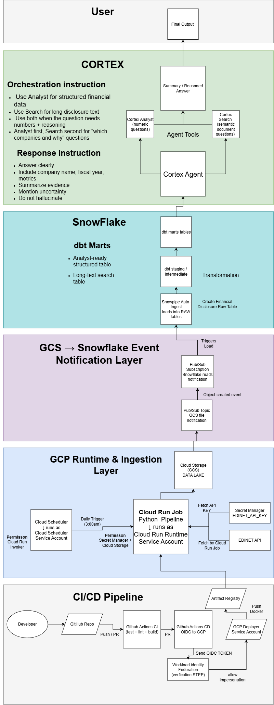

# EDINET Financial Disclosure Data Platform with Snowflake, dbt, and Cortex Agent

This project is a production-style data and AI engineering platform for collecting, transforming, and analyzing EDINET financial disclosure data.

The system collects financial disclosure data from the EDINET API, stores raw files in Google Cloud Storage, loads the data into Snowflake, transforms it with dbt, and prepares AI-ready tables for analysis with Snowflake Cortex Agent.

The platform combines cloud automation, data warehousing, dbt transformations, CI/CD, infrastructure as code, and an AI agent layer.

---

## Architecture

### High-Level Architecture

The high-level architecture shows the overall data flow from EDINET data ingestion to Snowflake transformation and AI-ready tables.


### Cortex Agent Architecture

The detailed architecture shows the implementation design, including GCP runtime, GCS to Snowflake ingestion, dbt models, Cortex Agent, Cortex Analyst, Cortex Search, and CI/CD.



---

## System Layers

### 1. GCP Runtime and Ingestion Layer

The ingestion pipeline runs on Google Cloud using Cloud Run Jobs.

Main components:

* **Cloud Scheduler** triggers the pipeline on a schedule
* **Cloud Run Job** runs the Python ingestion pipeline
* **Secret Manager** stores the EDINET API key
* **Google Cloud Storage** stores raw EDINET files
* **Cloud Run Job Service Account** controls runtime permissions

The Python pipeline retrieves disclosure metadata and financial documents from the EDINET API. It handles retries, extracts CSV files from ZIP documents, and uploads the raw files to GCS.

---

### 2. GCS to Snowflake Ingestion Layer

Google Cloud Storage is used as the raw data lake before data is loaded into Snowflake.

The planned ingestion flow is:

```text
GCS object-created notification
  ↓
Pub/Sub topic
  ↓
Pub/Sub subscription
  ↓
Snowpipe auto-ingest
  ↓
Snowflake RAW tables
```

This design creates a scalable path from cloud storage into the Snowflake data warehouse.

---

### 3. Snowflake Data Warehouse Layer

Snowflake is used as the main analytical warehouse.

The data warehouse flow is organized as:

```text
RAW tables
  ↓
dbt staging models
  ↓
dbt intermediate models
  ↓
dbt marts
  ↓
AI-ready tables
```

The **RAW layer** stores EDINET data in its original or minimally processed form.

The **dbt layer** cleans and transforms the raw data. This includes deduplication, latest-version selection, financial metric extraction, company-level aggregation, and long-text preparation for semantic search.

The final dbt marts create two AI-ready table groups:

| Table group                     | Used by        | Purpose                                                                                        |
| ------------------------------- | -------------- | ---------------------------------------------------------------------------------------------- |
| Analyst-ready structured tables | Cortex Analyst | Financial metrics, revenue, growth rates, fiscal years, rankings, and company comparisons      |
| Search-ready long-text tables   | Cortex Search  | Disclosure text, business explanations, risk factors, growth drivers, and qualitative evidence |

This separation allows the system to support both structured financial analysis and document-based reasoning.

---

### 4. Cortex Agent Layer

The AI layer is built around Snowflake Cortex Agent.

Cortex Agent sits on top of the AI-ready Snowflake tables and decides which tool to use based on the user question.

| Tool           | Connected data                  | Purpose                                                     |
| -------------- | ------------------------------- | ----------------------------------------------------------- |
| Cortex Analyst | Analyst-ready structured tables | Answers numeric and structured financial questions          |
| Cortex Search  | Search-ready long-text tables   | Retrieves relevant disclosure text and qualitative evidence |

For structured questions, the agent uses **Cortex Analyst** to answer questions about revenue, growth rate, fiscal year, company name, rankings, and comparisons.

For document-based questions, the agent uses **Cortex Search** to retrieve relevant filing text, business descriptions, risk factors, and growth drivers.

For questions that require both numbers and explanation, the agent can use both tools. For example, it can first identify high-growth companies with Cortex Analyst, then use Cortex Search to find the disclosure text explaining their growth.

The final answer combines structured metrics and supporting evidence into a clear response for the user.

Example questions:

```text
Which companies have revenue growth above 40%?
Why is this company considered high growth?
What are the main growth drivers mentioned in the filing?
Compare the growth factors of two companies.
Which industries contain the most high-growth companies?
Show the financial trend for this company over time.
```

---

## Key Technologies

* **Python** for EDINET API ingestion
* **Google Cloud Run Jobs** for scheduled pipeline execution
* **Google Cloud Storage** for raw file storage
* **Secret Manager** for secure API key management
* **Snowflake** for the data warehouse
* **Snowpipe** for GCS to Snowflake ingestion
* **dbt** for data transformation
* **Cortex Analyst** for structured financial analysis
* **Cortex Search** for semantic search over disclosure text
* **Cortex Agent** for AI orchestration
* **Terraform** for infrastructure as code
* **GitHub Actions** for CI/CD
