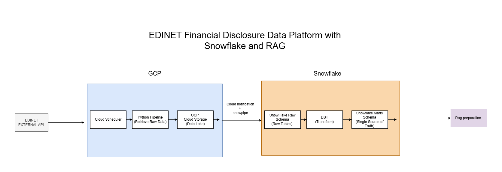

# EDINET Financial Disclosure Data Platform with Snowflake and RAG

This project is a data platform for collecting, transforming, and preparing EDINET financial disclosure data for growth company analysis and future RAG-based financial document search.

The current architecture is designed as the first stage of a production-style data pipeline using GCP, Snowflake, dbt, and RAG preparation.

## Architecture



## Main Components

### EDINET External API

The pipeline retrieves financial disclosure data from the EDINET API, including filing metadata and financial statement data.

### Python Ingestion Pipeline

The Python pipeline fetches raw EDINET data and saves the retrieved files into Google Cloud Storage.

### GCP Cloud Storage

Google Cloud Storage is used as the raw data lake. Raw EDINET files are stored here before being loaded into Snowflake.

### Snowpipe

Snowpipe loads newly added files from Cloud Storage into Snowflake RAW tables using cloud notifications.

### Snowflake RAW Schema

The RAW schema stores the ingested EDINET data in its original or minimally processed form.

### dbt Transformations

dbt transforms the RAW tables into clean, structured analytics tables. The transformation flow is organized into staging, intermediate, and marts layers.

### Snowflake MARTS Schema

The MARTS schema contains analytics-ready tables used as the source of truth for growth company analysis.

Example marts include:

* `mart_company_growth`
* `mart_high_growth_companies`
* `mart_industry_growth_summary`
* `mart_company_financial_trends`

### RAG Preparation

The RAG preparation stage prepares financial disclosure text for future retrieval-augmented generation workflows.

This stage includes:

* extracting filing text
* chunking Japanese financial disclosure documents
* attaching metadata such as company name, EDINET code, filing date, fiscal year, and industry
* preparing the data for retrieval through a RAG application

## Current Scope

This project focuses on the first stage of the platform:

* EDINET data ingestion
* raw data storage
* Snowflake warehouse design
* dbt-based transformation
* analytics-ready marts
* initial RAG preparation design

The RAG application layer, such as LlamaIndex, FastAPI, Streamlit, and LLM response generation, can be added in the next stage.

## Planned RAG Extension

The planned RAG layer will allow users to ask natural-language questions over EDINET financial data and disclosure documents.

Example questions:

```text
Which companies have revenue growth above 40%?
Why is this company considered high growth?
What are the main growth drivers mentioned in the filing?
Compare the growth factors of two companies.
Which industries contain the most high-growth companies?
```

The RAG system will combine:

* SQL retrieval from Snowflake MARTS tables for exact financial metrics
* semantic retrieval from filing text chunks for explanation and evidence

## Technologies

* Python
* Google Cloud Platform
* Cloud Scheduler
* Cloud Run Jobs
* Google Cloud Storage
* Snowflake
* Snowpipe
* dbt
* SQL
* RAG preparation
* LlamaIndex planned for the next stage

## Environment Variables

Create a `.env` file based on `.env.example`.

```env
EDINET_API_KEY=your_api_key_here
```

Additional environment variables for GCP, Snowflake, and RAG services can be added as the production pipeline is implemented.

## Local Execution

Install dependencies:

```bash
pip install -r requirements.txt
```

Run the ingestion pipeline:

```bash
python main.py
```

Run dbt transformations:

```bash
cd edinet_dbt
dbt run --profiles-dir .
dbt test --profiles-dir .
cd ..
```

## Docker Execution

Build the Docker image:

```bash
docker build -t edinet-growth-platform .
```

Run the pipeline:

```bash
docker run --env-file .env -v ${PWD}/data:/app/data edinet-growth-platform
```

## License

This repository is currently intended for private project development.
All rights reserved.
